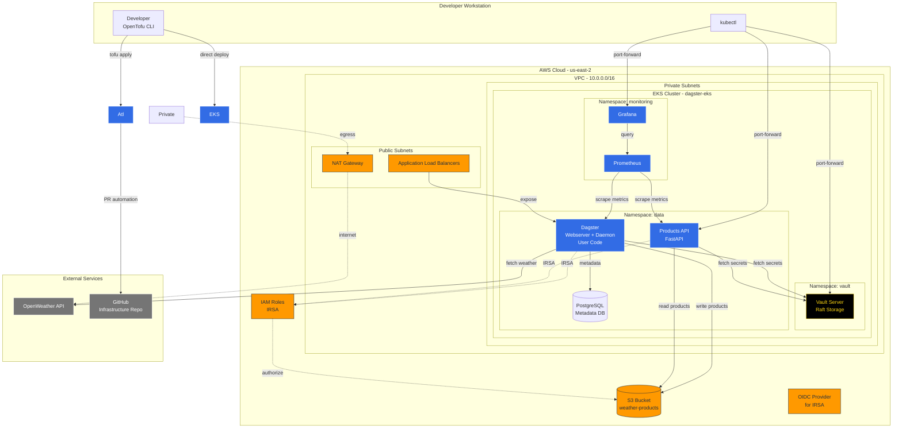
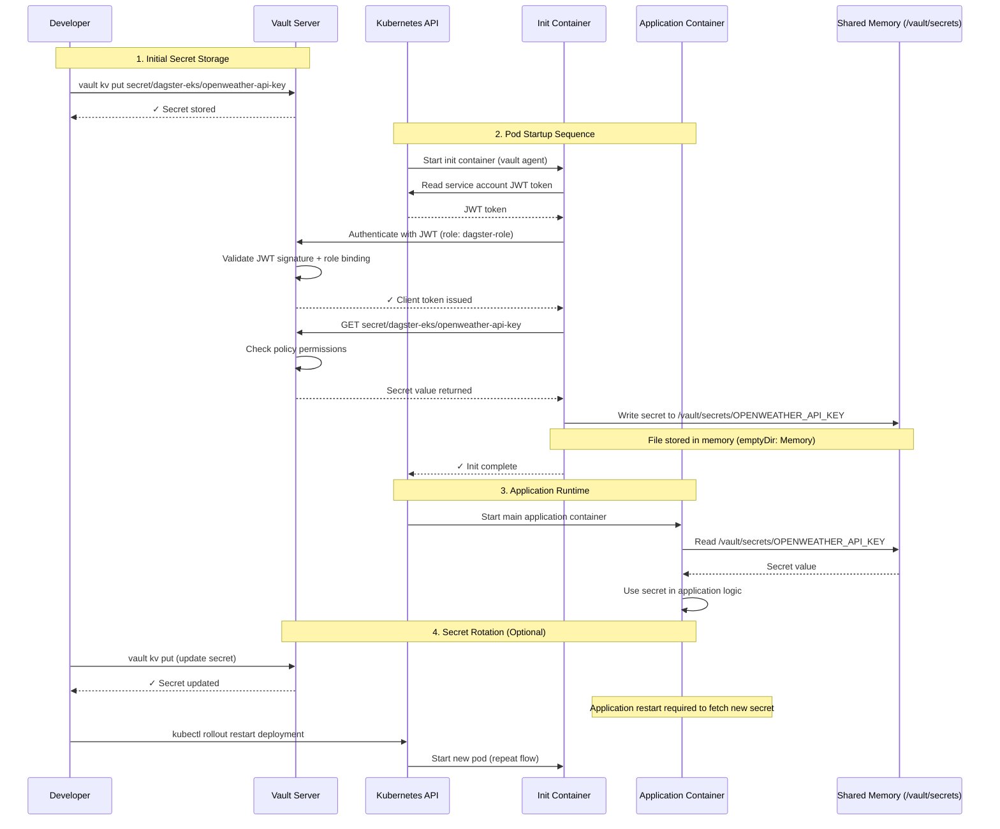
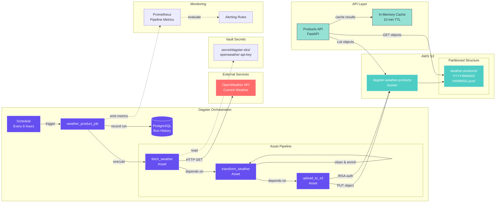
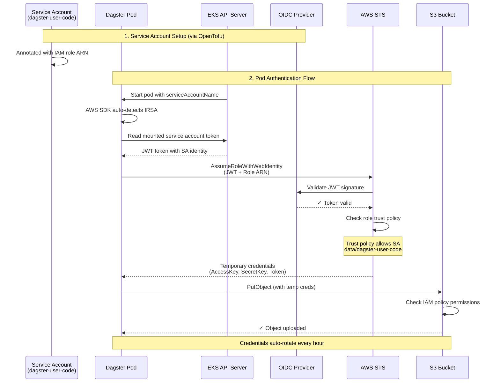
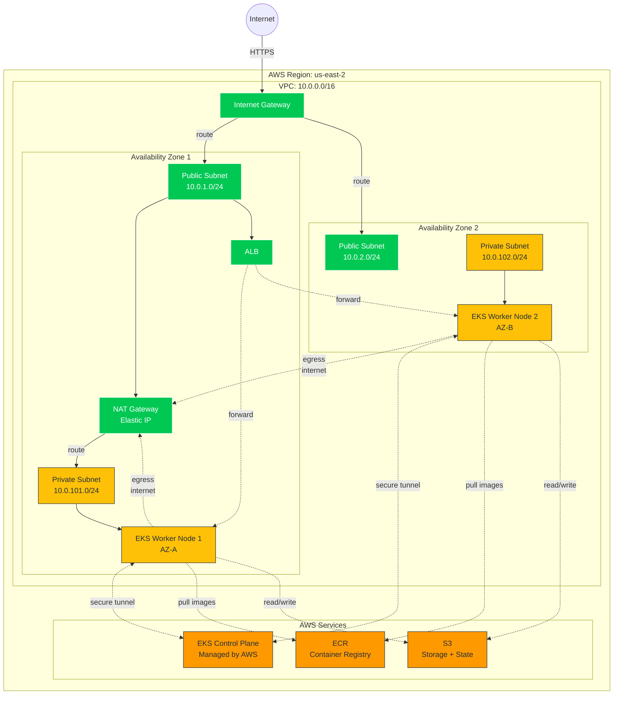
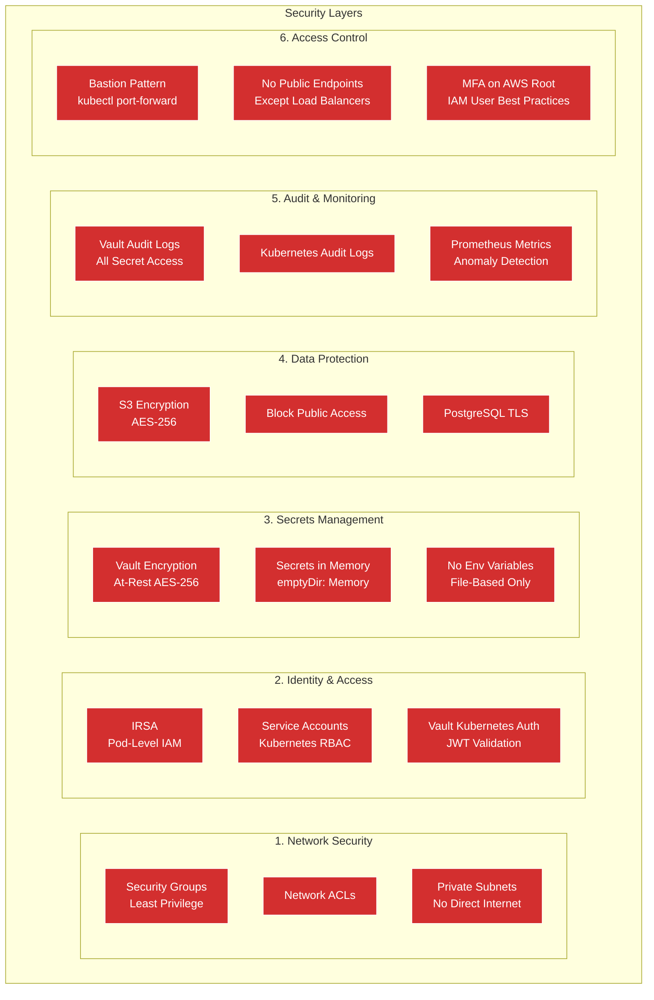

# Architecture Decisions & Scalability Considerations

This document explains the architectural decisions made in this DevOps infrastructure demo and how they would evolve for production-scale environments.

---

## Table of Contents
1. [Access Patterns & Security](#access-patterns--security)
2. [Service Mesh Considerations](#service-mesh-considerations)
3. [Secrets Management](#secrets-management)
4. [Monitoring & Observability](#monitoring--observability)
5. [Infrastructure as Code](#infrastructure-as-code)
6. [Scaling Considerations](#scaling-considerations)
7. [Karpenter: Advanced Autoscaling](#karpenter-advanced-autoscaling)
8. [Multi-Cluster Architecture](#multi-cluster-architecture)
9. [Cost Optimization](#cost-optimization)

---

## Access Patterns & Security

### Decision: Port Forwarding + Bastion Host (Current)

**What we implemented:**
- Bastion host in public subnet for SSH access to cluster
- `kubectl port-forward` for accessing internal services (Grafana, Dagster UI, API)
- ClusterIP services for internal communication
- LoadBalancer only for Prometheus/Grafana (demo purposes)

**Why this approach for demo:**
- **Cost-effective**: No ALB/NLB charges (~$16-25/month per load balancer)
- **Security-first**: Services not exposed to internet by default
- **Simplicity**: No complex ingress controller configuration
- **Interview-friendly**: Easy to demonstrate in a time-boxed demo

**Production evolution path:**

```
Demo (Now)              → Small Production        → Large Production
─────────────────────────────────────────────────────────────────────
Port forwarding         → ALB Ingress Controller  → ALB + API Gateway
Bastion host            → AWS SSM Session Manager → Private Link + VPN
ClusterIP services      → Internal ALB            → Service mesh + mTLS
No WAF                  → WAF on ALB              → WAF + Shield Advanced
```

### When to switch to Ingress Controller:

**Triggers:**
- More than 5 external-facing services
- Need for centralized SSL termination
- Require path-based routing (e.g., `/api/v1`, `/api/v2`)
- Team growth (multiple developers need consistent access)
- Production traffic (not just internal users)

**Recommended stack:**
```yaml
Ingress: AWS Load Balancer Controller
  ├── ALB for public traffic
  ├── NLB for TCP/UDP workloads
  └── Integration with AWS WAF

SSL/TLS: cert-manager + Let's Encrypt
  └── Automatic certificate rotation

DNS: external-dns
  └── Automatic Route53 record management
```

### When to remove bastion host:

**Replace with:**
- **AWS Systems Manager Session Manager**: Browser-based SSH without bastion
- **AWS VPN / Direct Connect**: For corporate network integration
- **Private Link**: For service-to-service connectivity across VPCs

**Benefits:**
- No public SSH port exposed
- Centralized access logging via CloudTrail
- MFA enforcement at AWS IAM level
- No EC2 instance to patch/maintain

---

## Service Mesh Considerations

### Decision: No Service Mesh (Current)

**Why we don't need it at this scale:**

| Requirement | Current Solution | Service Mesh Alternative |
|-------------|-----------------|-------------------------|
| Service discovery | Kubernetes DNS | Istio/Linkerd service registry |
| Load balancing | kube-proxy (L4) | Envoy (L7 with retries/timeouts) |
| TLS encryption | Not required (3 services) | Automatic mTLS everywhere |
| Observability | Prometheus + Grafana | Distributed tracing built-in |
| Traffic control | Not needed | Canary/blue-green deployments |

**Current service count: 3 business services**
- Dagster (data pipeline orchestration)
- Products API (FastAPI)
- PostgreSQL (database)

**Service mesh makes sense when:**

### Quantitative Triggers:
- **10+ microservices** with complex inter-service communication
- **50+ API calls per second** between services requiring circuit breaking
- **Multiple teams** (5+) deploying services independently
- **Compliance requirement** for mTLS on all internal traffic
- **Multi-cluster** deployments requiring unified service mesh

### Use Case Examples:

#### When NOT to use (like this demo):
```
┌─────────┐
│ API     │──────▶ S3 Bucket
└─────────┘
     │
     ▼
┌─────────┐
│ Dagster │──────▶ PostgreSQL
└─────────┘
```
- Linear data flow
- 2-3 service hops maximum
- No complex retry/timeout logic needed

#### When TO use (production microservices):
```
┌──────┐    ┌──────┐    ┌──────┐
│ API  │───▶│ Auth │───▶│ User │
└──────┘    └──────┘    └──────┘
   │           │           │
   ▼           ▼           ▼
┌──────┐    ┌──────┐    ┌──────┐
│Order │───▶│ Pay  │───▶│ Ship │
└──────┘    └──────┘    └──────┘
   │           │           │
   ▼           ▼           ▼
┌──────┐    ┌──────┐    ┌──────┐
│ Inv. │───▶│ Notif│───▶│ Logs │
└──────┘    └──────┘    └──────┘
```
- 10+ services with complex call graphs
- Need for circuit breaking (if Payment fails, don't block Order)
- Canary deployments (route 5% traffic to new version)
- A/B testing (route based on headers/user segments)

### Service Mesh Comparison:

| Feature | Istio | Linkerd | Consul |
|---------|-------|---------|--------|
| **Complexity** | High | Low | Medium |
| **Resource overhead** | 200-400MB per node | 50-100MB per node | 100-200MB per node |
| **Learning curve** | Steep | Gentle | Medium |
| **Best for** | Large enterprises | Simplicity-first | Multi-cloud/hybrid |
| **mTLS** | Yes (complex setup) | Yes (automatic) | Yes |
| **Observability** | Kiali + Jaeger | Built-in | Built-in + UI |
| **Multi-cluster** | Yes | Limited | Yes |

### Incremental Path (if you scale to 10+ services):

**Phase 1: Observability without mesh**
```bash
# Add OpenTelemetry for tracing
helm install opentelemetry-operator
# Instrument your apps with OTEL SDK
# Export traces to Jaeger/Tempo
```

**Phase 2: Introduce lightweight mesh**
```bash
# Start with Linkerd (easiest)
linkerd install | kubectl apply -f -
# Inject into one namespace first
kubectl annotate namespace dagster linkerd.io/inject=enabled
```

**Phase 3: Advanced traffic management**
```bash
# Migrate to Istio if you need:
# - Multi-cluster service mesh
# - Complex traffic routing (weighted routes, mirrors)
# - Integration with external systems
```

---

## Secrets Management

### Decision: HashiCorp Vault + IRSA (Current)

**Architecture:**
```
┌─────────────────────────────────────────────────┐
│ Pod (Dagster/API)                               │
│  ┌────────────────────────────────────────────┐ │
│  │ Init Container                             │ │
│  │  1. Get JWT from ServiceAccount            │ │
│  │  2. Authenticate to Vault (K8s auth)       │ │
│  │  3. Fetch secrets                          │ │
│  │  4. Write to shared volume (/vault/secrets)│ │
│  └────────────────────────────────────────────┘ │
│  ┌────────────────────────────────────────────┐ │
│  │ Application Container                      │ │
│  │  - Reads secrets from files                │ │
│  │  - No Vault client needed                  │ │
│  └────────────────────────────────────────────┘ │
└─────────────────────────────────────────────────┘
```

**Why Vault over alternatives:**

| Solution | Pros | Cons | When to use |
|----------|------|------|-------------|
| **Vault (chosen)** | Centralized, audit logging, dynamic secrets | Operational overhead | Multi-environment, compliance needs |
| **AWS Secrets Manager** | Managed service, auto-rotation | AWS-only, costs scale with secrets | AWS-native apps only |
| **K8s Secrets + SOPS** | Simple, GitOps-friendly | No audit trail, manual rotation | Small teams, low security reqs |
| **External Secrets Operator** | Multiple backend support | Extra abstraction layer | Multi-cloud secrets |

**Why IRSA (IAM Roles for Service Accounts):**
- No long-lived AWS credentials in pods
- Fine-grained IAM permissions per service account
- Automatic credential rotation via STS
- Works with: S3, RDS, DynamoDB, SQS, etc.

**Production enhancements:**

```yaml
Current Setup:
  - Vault in dev mode (no HA)
  - Secrets stored in Vault KV v2
  - Manual secret creation via scripts

Production:
  - Vault HA with 3+ replicas
  - Vault Auto-Unseal via AWS KMS
  - Secrets injected via Vault Agent Injector (sidecar)
  - Vault Enterprise features:
    * Namespaces (multi-tenancy)
    * Replication (DR across regions)
    * HSM integration for root keys
  - Secrets rotation policy (90 days)
  - Break-glass procedures documented
```

---

## Monitoring & Observability

### Decision: Prometheus + Grafana (kube-prometheus-stack)

**Current implementation:**
- Prometheus for metrics collection
- Grafana for visualization
- AlertManager for alerting (Slack integration)
- ServiceMonitors for automatic target discovery

**The three pillars of observability:**

```
┌─────────────────────────────────────────────────┐
│                   OBSERVABILITY                 │
├─────────────┬──────────────┬───────────────────┤
│   METRICS   │     LOGS     │      TRACES       │
├─────────────┼──────────────┼───────────────────┤
│ Prometheus  │ CloudWatch   │ (Not implemented) │
│ Grafana     │ Logs Insights│                   │
│             │              │                   │
│ What we     │ What we      │ What we would add │
│ have now    │ have now     │ in production     │
└─────────────┴──────────────┴───────────────────┘
```

**Why this stack:**
- **Industry standard**: Prometheus is CNCF graduated project
- **Kubernetes-native**: ServiceMonitor CRDs for auto-discovery
- **Cost-effective**: Self-hosted vs. $50-500/month for Datadog/New Relic
- **Flexible**: 500+ pre-built Grafana dashboards available

**Scaling path:**

### Current (demo):
```
Prometheus (single instance)
  ├── Retention: 15 days
  ├── Storage: 50GB local disk
  └── Scrape interval: 30s
```

### Small production:
```
Prometheus
  ├── HA mode (2 replicas)
  ├── Retention: 30 days
  ├── Storage: 500GB EBS gp3
  └── Thanos sidecar for long-term storage
```

### Large production:
```
Thanos (distributed metrics)
  ├── Prometheus replicas in each AZ
  ├── Thanos Query (federated queries)
  ├── Thanos Store (S3 for 1 year retention)
  ├── Thanos Compactor (downsampling)
  └── Thanos Ruler (global alerting)

Alternative: Mimir (Grafana's Cortex fork)
  └── Better for 1M+ active series
```

### Adding distributed tracing (production):

**When you need it:**
- Debugging latency across 5+ microservices
- Understanding service dependencies
- Finding performance bottlenecks in call chains

**Implementation:**
```yaml
Stack: OpenTelemetry + Tempo/Jaeger

OpenTelemetry Collector:
  ├── Receivers: OTLP, Jaeger, Zipkin
  ├── Processors: Batch, sampling
  └── Exporters: Tempo, Jaeger

Tempo (Grafana Tempo):
  ├── S3 backend for traces
  ├── Grafana integration
  └── 30-day retention

Application changes:
  ├── Add OTEL SDK to Python apps
  ├── Instrument HTTP/gRPC calls
  └── Propagate trace context
```

**Alerting maturity levels:**

```
Level 1 (Current):
  ├── Basic alerts (pod down, disk full)
  └── Slack notifications

Level 2 (Small prod):
  ├── SLO-based alerts (99.9% uptime)
  ├── Multi-channel (Slack, PagerDuty)
  └── Alert aggregation/silencing

Level 3 (Large prod):
  ├── ML-based anomaly detection
  ├── Intelligent routing (time-based, severity)
  ├── Alert correlation
  └── Automated remediation (auto-scaling)
```

---

## Infrastructure as Code

### Decision: OpenTofu

**Why OpenTofu over Terraform:**
- **Open-source**: No HashiCorp license concerns
- **Community-driven**: CNCF-backed governance
- **Compatible**: Drop-in replacement for Terraform
- **Future-proof**: True open-source alternative

**Production evolution:**

```
Current:
  ├── Manual deployment via scripts
  └── Single AWS account

Scaling to multi-account:
  ├── GitOps automation (Atlantis/FluxCD/ArgoCD)
  ├── Separate repos per environment
  │   ├── infra-dev/
  │   ├── infra-staging/
  │   └── infra-prod/
  └── Cross-account IAM roles

Enterprise scale:
  ├── Terraform Cloud/Spacelift/env0
  ├── Policy as Code (OPA/Sentinel)
  ├── Cost estimation in PR
  ├── Drift detection
  └── RBAC for team-based access
```

**Alternative IaC approaches:**

| Tool | Best For | Limitations |
|------|----------|-------------|
| **OpenTofu/Terraform** | Multi-cloud, mature ecosystem | State management complexity |
| **Pulumi** | Developers (use Python/Go/TS) | Smaller community |
| **AWS CDK** | AWS-only, programmatic IaC | AWS-locked |
| **Crossplane** | K8s-native resource management | Limited provider support |
| **CloudFormation** | AWS-only, no extra tooling | Verbose YAML, slower |

**State management best practices:**

```
Current:
  ├── S3 backend with versioning
  ├── DynamoDB lock table
  └── Server-side encryption

Production:
  ├── Separate state per environment
  ├── State file access via IAM roles
  ├── Backup/restore procedures
  ├── State lock timeout monitoring
  └── Terraform Cloud remote state (optional)
```

---

## Scaling Considerations

### Cluster Autoscaling (Current: Cluster Autoscaler)

**What we have:**
```yaml
Cluster Autoscaler:
  ├── Scales node groups based on pending pods
  ├── Scale down after 10 minutes of underutilization
  └── Works with AWS Auto Scaling Groups
```

**Production alternatives:**

| Solution | Scaling Logic | Cost Optimization | When to use |
|----------|---------------|-------------------|-------------|
| **Cluster Autoscaler** (current) | Pod-driven | Basic (scale down delay) | Simple workloads |
| **Karpenter** | Pod-driven + bin-packing | Advanced (right-sizing) | Variable workloads |
| **Kubernetes HPA** | Metrics-driven (CPU/memory) | N/A (scales pods, not nodes) | Application scaling |

**Karpenter advantages (for production):**
```
Why switch to Karpenter:
  ├── Faster scaling (30s vs 2-3 min)
  ├── Better bin-packing (cost savings)
  ├── Instance type flexibility
  │   └── Can choose from 100+ instance types
  ├── Spot instance support
  │   └── 70% cost savings with automatic fallback
  └── Consolidation (proactive right-sizing)
```

### Node Sizing Strategy

**Current (demo):**
```
Instance type: t3.medium (2 vCPU, 4GB RAM)
Min nodes: 1
Desired: 2
Max nodes: 5
```

**Production sizing:**

```
Workload profiling:
  1. Run for 1 week, collect metrics
  2. Calculate P95 CPU/memory usage
  3. Add 30% headroom buffer
  4. Choose instance type

Example calculation:
  Avg CPU: 1.2 vCPU
  P95 CPU: 2.5 vCPU
  With 30% buffer: 3.25 vCPU
  → Choose: t3.xlarge (4 vCPU, 16GB RAM)

Multi-node group strategy:
  ├── on-demand-compute (t3.xlarge, 2-10 nodes)
  │   └── For stateful/critical workloads
  ├── spot-compute (mix of c5.xlarge/m5.xlarge)
  │   └── For batch jobs (70% cost savings)
  └── gpu-compute (g4dn.xlarge, 0-5 nodes)
      └── For ML training workloads
```

### Database Scaling

**Current:** PostgreSQL in pod (Dagster's bundled DB)

**Production evolution:**

```
Stage 1 (demo):
  └── PostgreSQL pod with 20GB PVC

Stage 2 (small prod):
  ├── AWS RDS PostgreSQL
  ├── Instance: db.t3.medium (2 vCPU, 4GB RAM)
  ├── Multi-AZ: false
  └── Backup: 7-day retention

Stage 3 (production):
  ├── RDS PostgreSQL
  ├── Instance: db.r5.xlarge (4 vCPU, 32GB RAM)
  ├── Multi-AZ: true (HA)
  ├── Read replicas: 2
  ├── Backup: 30-day retention + PITR
  └── Performance Insights enabled

Stage 4 (high scale):
  ├── Amazon Aurora PostgreSQL
  ├── Auto-scaling: 2-15 Aurora replicas
  ├── Global database (multi-region)
  ├── Aurora Serverless v2 (burstable)
  └── Zero-downtime patching
```

---

## Karpenter: Advanced Autoscaling

### What is Karpenter?

**Karpenter** is an open-source Kubernetes cluster autoscaler built by AWS. Unlike the traditional Cluster Autoscaler, Karpenter directly provisions compute resources (EC2 instances) without relying on pre-defined Auto Scaling Groups.

**Key Concept:** Karpenter watches for **unschedulable pods** and provisions exactly the right compute capacity needed, choosing from hundreds of instance types dynamically.

### Cluster Autoscaler vs Karpenter

| Feature | Cluster Autoscaler (Current) | Karpenter |
|---------|----------------------------|-----------|
| **Scaling Speed** | 2-3 minutes (ASG launch time) | 30-60 seconds (direct EC2 API) |
| **Instance Type Selection** | Fixed (defined in node group) | Dynamic (100+ types) |
| **Node Groups** | Requires pre-configured ASGs | No ASGs needed |
| **Bin Packing** | Basic (fills existing nodes first) | Advanced (optimal placement) |
| **Spot Support** | Manual fallback configuration | Automatic Spot/On-Demand mix |
| **Consolidation** | Reactive (waits for timeout) | Proactive (rebalances nodes) |
| **Cost Optimization** | Basic | Advanced (right-sizing) |
| **Configuration** | Kubernetes Deployment | Custom CRDs (Provisioner) |

### How Karpenter Works

```
┌──────────────────────────────────────────────────────────────┐
│ 1. Developer creates Deployment with resource requests        │
│    - Pod needs: 2 vCPU, 4GB RAM                              │
│    - No nodes available with capacity                         │
└────────────────────┬─────────────────────────────────────────┘
                     │
                     ▼
┌──────────────────────────────────────────────────────────────┐
│ 2. Karpenter detects pending pod                             │
│    - Analyzes pod requirements                                │
│    - Checks existing node capacity                            │
│    - Decision: Need new node                                  │
└────────────────────┬─────────────────────────────────────────┘
                     │
                     ▼
┌──────────────────────────────────────────────────────────────┐
│ 3. Karpenter selects optimal instance type                   │
│    - Evaluates 100+ instance types (t3, m5, c5, r5, etc.)   │
│    - Considers: CPU, memory, network, cost                   │
│    - Decision: Launch c5.xlarge (4 vCPU, 8GB, $0.17/hr)     │
│    - Uses Spot if available (70% cheaper)                    │
└────────────────────┬─────────────────────────────────────────┘
                     │
                     ▼
┌──────────────────────────────────────────────────────────────┐
│ 4. Karpenter provisions node directly via EC2 API            │
│    - Launches instance in 30-60 seconds                      │
│    - Joins EKS cluster automatically                          │
│    - Pod scheduled immediately                                │
└────────────────────┬─────────────────────────────────────────┘
                     │
                     ▼
┌──────────────────────────────────────────────────────────────┐
│ 5. Continuous optimization (consolidation)                   │
│    - Monitors node utilization                                │
│    - Detects underutilized nodes                              │
│    - Repacks pods onto fewer nodes                            │
│    - Terminates idle nodes (cost savings)                     │
└──────────────────────────────────────────────────────────────┘
```

### Example: Karpenter Configuration

**Provisioner CRD** (defines how Karpenter should provision nodes):

```yaml
apiVersion: karpenter.sh/v1alpha5
kind: Provisioner
metadata:
  name: default
spec:
  # Requirements for nodes
  requirements:
    - key: karpenter.sh/capacity-type
      operator: In
      values: ["spot", "on-demand"]  # Try Spot first, fallback to On-Demand
    - key: kubernetes.io/arch
      operator: In
      values: ["amd64"]
    - key: karpenter.k8s.aws/instance-category
      operator: In
      values: ["c", "m", "r", "t"]  # Compute, General, Memory, Burstable
    - key: karpenter.k8s.aws/instance-generation
      operator: Gt
      values: ["4"]  # Only use 5th gen or newer (c5, m5, etc.)

  # Resource limits (prevent runaway scaling)
  limits:
    resources:
      cpu: "1000"      # Max 1000 vCPUs across all nodes
      memory: 1000Gi   # Max 1000GB RAM

  # Consolidation settings
  consolidation:
    enabled: true  # Automatically repack pods to reduce node count

  # Provider-specific settings
  providerRef:
    name: default

---
apiVersion: karpenter.k8s.aws/v1alpha1
kind: AWSNodeTemplate
metadata:
  name: default
spec:
  subnetSelector:
    karpenter.sh/discovery: dagster-eks  # Use cluster's private subnets
  securityGroupSelector:
    karpenter.sh/discovery: dagster-eks  # Use cluster's security groups

  # Instance profile for nodes (IAM role)
  instanceProfile: KarpenterNodeInstanceProfile

  # User data (bootstrap script)
  userData: |
    #!/bin/bash
    /etc/eks/bootstrap.sh dagster-eks

  # Tags
  tags:
    Name: karpenter-node
    ManagedBy: karpenter
```

### Real-World Example: Cost Savings

**Scenario:** Dagster job needs to process large dataset

```
Traditional Cluster Autoscaler:
  1. Pod requests: 8 vCPU, 16GB RAM
  2. No capacity on existing nodes (fixed instance type)
  3. Scales up new node in same node group
  4. Launch time: 2-3 minutes
  5. Node capacity insufficient (need multiple nodes)
  6. Scales up another node
  7. Total nodes: Multiple small nodes to fit workload
  8. Pod potentially fragmented across nodes
  9. Higher total cost due to inefficient bin-packing
  10. Scale down delay: 10 minutes after job completes

Karpenter:
  1. Pod requests: 8 vCPU, 16GB RAM
  2. Karpenter analyzes requirements
  3. Evaluates: c5.2xlarge (8 vCPU, 16GB, $0.34/hr On-Demand)
  4. Checks Spot availability: c5.2xlarge Spot = $0.10/hr (70% off!)
  5. Launches Spot instance in 30-60 seconds
  6. Pod scheduled immediately on right-sized node
  7. Lower cost through optimal instance selection + Spot
  8. Terminates node within 30s after pod completes

Savings: 40-70% cost reduction + 75% faster scaling
```

### When to Switch to Karpenter

**Stay with Cluster Autoscaler if:**
- You have predictable, stable workloads
- You prefer simple, battle-tested solutions
- You have strict compliance requiring ASGs

**Switch to Karpenter if:**
- Variable workloads (batch jobs, ML training, data processing)
- Cost optimization is critical
- You need fast scaling (< 1 minute)
- You want to use Spot instances heavily
- You have diverse pod resource requirements

### Migration Path: Cluster Autoscaler → Karpenter

```
Phase 1: Run Both (Canary)
  ├── Keep Cluster Autoscaler for production workloads
  ├── Deploy Karpenter for non-critical batch jobs
  ├── Compare costs and performance
  └── Duration: 2-4 weeks

Phase 2: Gradual Migration
  ├── Move batch workloads to Karpenter
  ├── Move stateless services to Karpenter
  ├── Keep stateful workloads on Cluster Autoscaler
  └── Duration: 1-2 months

Phase 3: Full Karpenter
  ├── Remove Cluster Autoscaler
  ├── All workloads on Karpenter
  └── Continuous monitoring and tuning
```

### Karpenter Limitations

1. **AWS-only** (for now) - Native support only for EKS
   - Azure/GCP support in development
2. **Learning curve** - More complex than Cluster Autoscaler
3. **Stateful workloads** - Requires careful configuration for EBS volumes
4. **Spot interruptions** - Need graceful shutdown handlers

### Implementation in This Project

**If we added Karpenter:**

```hcl
# opentofu/karpenter.tf
resource "helm_release" "karpenter" {
  name       = "karpenter"
  repository = "oci://public.ecr.aws/karpenter"
  chart      = "karpenter"
  namespace  = "karpenter"
  version    = "v0.32.0"

  values = [yamlencode({
    serviceAccount = {
      annotations = {
        "eks.amazonaws.com/role-arn" = aws_iam_role.karpenter.arn
      }
    }
    settings = {
      aws = {
        clusterName     = var.cluster_name
        clusterEndpoint = aws_eks_cluster.this.endpoint
        defaultInstanceProfile = aws_iam_instance_profile.karpenter.name
      }
    }
  })]
}

# Provisioner for Dagster batch jobs
resource "kubectl_manifest" "karpenter_provisioner_batch" {
  yaml_body = yamlencode({
    apiVersion = "karpenter.sh/v1alpha5"
    kind       = "Provisioner"
    metadata = {
      name = "batch-jobs"
    }
    spec = {
      requirements = [
        {
          key      = "karpenter.sh/capacity-type"
          operator = "In"
          values   = ["spot"]  # Batch jobs can tolerate interruptions
        },
        {
          key      = "karpenter.k8s.aws/instance-category"
          operator = "In"
          values   = ["c", "m", "r"]  # Compute-optimized for data processing
        }
      ]
      limits = {
        resources = {
          cpu    = "100"
          memory = "200Gi"
        }
      }
      consolidation = {
        enabled = true
      }
      labels = {
        workload-type = "batch"
      }
    }
  })
}
```

**Benefits for this project:**
- Dagster batch jobs scale faster (weather pipeline completes quicker)
- Cost savings: Spot instances for non-critical jobs
- Better resource utilization during idle periods

---

## Multi-Cluster Architecture

### What is Multi-Cluster?

**Multi-cluster** means running multiple independent Kubernetes clusters, each serving a specific purpose (environment, region, team, or workload type).

**Current setup:** Single EKS cluster running all workloads (Dagster, API, Vault, monitoring).

**Multi-cluster setup:** Separate clusters for dev, staging, production, or geographic regions.

### Why Multi-Cluster?

| Reason | Description | Example |
|--------|-------------|---------|
| **Environment Isolation** | Separate dev/staging/prod for safety | Deploy breaking change to dev without affecting prod |
| **Blast Radius Reduction** | Failures contained to one cluster | Cluster upgrade fails in staging, prod unaffected |
| **Compliance** | Regulatory requirements for data residency | EU customer data must stay in eu-west-1 cluster |
| **Team Autonomy** | Teams manage their own clusters | Data Science team owns ML cluster, Platform team owns services cluster |
| **Geographic Distribution** | Low latency for global users | US cluster in us-east-1, EU cluster in eu-west-1 |
| **Cost Optimization** | Different clusters for different workload SLAs | Production on On-Demand, dev on Spot |

### Multi-Cluster Patterns

#### Pattern 1: Environment-Based (Most Common)

```
┌─────────────────────────────────────────────────────────────┐
│                   AWS Account: Production                    │
│                                                              │
│  ┌────────────────────┐  ┌────────────────────┐             │
│  │ EKS Cluster: Dev   │  │ EKS Cluster: Staging│            │
│  │ Region: us-east-1  │  │ Region: us-east-1   │            │
│  │                    │  │                     │            │
│  │ - Dagster (dev)    │  │ - Dagster (staging) │            │
│  │ - API (dev)        │  │ - API (staging)     │            │
│  │ - Spot instances   │  │ - Mixed instances   │            │
│  │ - No SLA           │  │ - 99% SLA           │            │
│  └────────────────────┘  └────────────────────┘             │
│                                                              │
│  ┌────────────────────┐                                     │
│  │ EKS Cluster: Prod  │                                     │
│  │ Region: us-east-1  │                                     │
│  │ Multi-AZ: Yes      │                                     │
│  │                    │                                     │
│  │ - Dagster (prod)   │                                     │
│  │ - API (prod)       │                                     │
│  │ - On-Demand only   │                                     │
│  │ - 99.9% SLA        │                                     │
│  │ - DR replica: ───────────────────────┐                  │
│  └────────────────────┘                 │                  │
│                                          │                  │
└──────────────────────────────────────────┼──────────────────┘
                                           │
                                           ▼
┌──────────────────────────────────────────────────────────────┐
│              AWS Account: Disaster Recovery                  │
│  ┌────────────────────┐                                      │
│  │ EKS Cluster: DR    │                                      │
│  │ Region: us-west-2  │                                      │
│  │                    │                                      │
│  │ - Minimal capacity │                                      │
│  │ - Scales on DR     │                                      │
│  └────────────────────┘                                      │
└──────────────────────────────────────────────────────────────┘
```

**Characteristics:**
- Each environment is a separate cluster
- Progressive promotion: dev → staging → prod
- Different resource configs per environment
- Isolated failures (dev cluster crash doesn't affect prod)

#### Pattern 2: Geographic Distribution

```
┌────────────────────────────────────────────────────────────┐
│                      Global Traffic                         │
│                  (Route53 Geolocation)                      │
└──────────────────────┬─────────────────────────────────────┘
                       │
          ┌────────────┴──────────────┐
          │                           │
          ▼                           ▼
┌──────────────────────┐    ┌──────────────────────┐
│ EKS Cluster: US      │    │ EKS Cluster: EU      │
│ Region: us-east-1    │    │ Region: eu-west-1    │
│                      │    │                      │
│ - Dagster API        │    │ - Dagster API        │
│ - S3: us-east-1      │    │ - S3: eu-west-1      │
│ - RDS: us-east-1     │    │ - RDS: eu-west-1     │
│ - Users: Americas    │    │ - Users: EU/Africa   │
│ - Latency: <50ms     │    │ - Latency: <50ms     │
│                      │◄───┼────► Cross-region    │
│                      │    │      replication      │
└──────────────────────┘    └──────────────────────┘
          │                           │
          ▼                           ▼
┌──────────────────────┐    ┌──────────────────────┐
│ EKS Cluster: APAC    │    │ EKS Cluster: Global  │
│ Region: ap-south-1   │    │ Region: us-east-1    │
│                      │    │                      │
│ - Dagster API        │    │ - Vault (global)     │
│ - S3: ap-south-1     │    │ - Prometheus (global)│
│ - RDS: ap-south-1    │    │ - Shared services    │
│ - Users: Asia-Pacific│    │                      │
│ - Latency: <50ms     │    │                      │
└──────────────────────┘    └──────────────────────┘
```

**Characteristics:**
- Each region has independent cluster
- Low latency for local users
- Data residency compliance (GDPR, etc.)
- Cross-region replication for critical data

#### Pattern 3: Workload-Based

```
┌─────────────────────────────────────────────────────────┐
│            EKS Cluster: Services (24/7 SLA)             │
│            Region: us-east-1                            │
│                                                         │
│  - Products API (user-facing)                           │
│  - Dagster Webserver UI                                 │
│  - PostgreSQL (RDS Multi-AZ)                            │
│  - On-Demand instances only                             │
│  - Auto-scaling: 5-20 nodes                             │
└─────────────────────────────────────────────────────────┘

┌─────────────────────────────────────────────────────────┐
│            EKS Cluster: Batch Jobs                       │
│            Region: us-east-1                            │
│                                                         │
│  - Dagster job execution                                │
│  - Data processing pipelines                            │
│  - ML training jobs                                     │
│  - 90% Spot instances (cost optimization)               │
│  - Auto-scaling: 0-100 nodes (bursty)                   │
│  - Karpenter for fast scaling                           │
└─────────────────────────────────────────────────────────┘

┌─────────────────────────────────────────────────────────┐
│            EKS Cluster: Platform Services               │
│            Region: us-east-1                            │
│                                                         │
│  - Vault (secrets)                                      │
│  - Prometheus/Grafana (monitoring)                      │
│  - ArgoCD (GitOps)                                      │
│  - Shared infrastructure                                │
│  - Small, stable cluster                                │
└─────────────────────────────────────────────────────────┘
```

**Characteristics:**
- Separate clusters by workload type
- Different SLAs and scaling policies
- Cost optimization (Spot for batch, On-Demand for services)
- Clear separation of concerns

### Multi-Cluster Management Tools

| Tool | Use Case | Complexity | Best For |
|------|----------|------------|----------|
| **kubectl contexts** | Manual switching | Low | 2-3 clusters |
| **Rancher** | Central management UI | Medium | 5-20 clusters |
| **ArgoCD** | GitOps multi-cluster deployments | Medium | Any scale |
| **Flux CD** | GitOps pull-based deployments | Medium | Any scale |
| **Crossplane** | Kubernetes-native multi-cloud | High | Large enterprises |
| **Cluster API** | Declarative cluster lifecycle | High | Platform teams |
| **Istio Multi-Primary** | Service mesh across clusters | High | 10+ clusters with mesh |

### Service Mesh for Multi-Cluster

**Problem:** How do services in one cluster talk to services in another?

**Solution 1: Shared Service Mesh (Istio Multi-Primary)**

```
┌──────────────────────────────────────────────────────────────┐
│                    Istio Control Plane                        │
│                   (Shared Trust Domain)                       │
└───────────────────┬──────────────────────────────────────────┘
                    │
        ┌───────────┴───────────┐
        │                       │
        ▼                       ▼
┌────────────────┐      ┌────────────────┐
│ Cluster 1      │      │ Cluster 2      │
│ us-east-1      │      │ eu-west-1      │
│                │      │                │
│ ┌────────────┐ │      │ ┌────────────┐ │
│ │ API Service│ │      │ │ Auth Service│ │
│ │ (Envoy)    │ │◄────►│ │ (Envoy)    │ │
│ └────────────┘ │ mTLS │ └────────────┘ │
│                │      │                │
└────────────────┘      └────────────────┘
```

**Features:**
- Automatic mTLS between clusters
- Service discovery across clusters
- Traffic management (route 10% to cluster-2)
- Unified observability

**Solution 2: External Load Balancer (Simpler)**

```
┌────────────────┐         ┌────────────────┐
│ Cluster 1      │         │ Cluster 2      │
│                │         │                │
│ ┌────────────┐ │         │ ┌────────────┐ │
│ │ API Service│ │  HTTP   │ │ API Service│ │
│ └────────────┘ │         │ └────────────┘ │
│       │        │         │       │        │
│       ▼        │         │       ▼        │
│   ┌──────┐    │         │   ┌──────┐    │
│   │ NLB  │    │◄───────►│   │ NLB  │    │
│   └──────┘    │  VPC    │   └──────┘    │
│       │       │ Peering │       │        │
└───────┼───────┘         └───────┼────────┘
        │                         │
        └─────────┬───────────────┘
                  │
          ┌───────▼────────┐
          │  Global ALB    │
          │  (Route53)     │
          └────────────────┘
```

### Implementing Multi-Cluster for This Project

**How I would evolve this demo to multi-cluster:**

```
Current (Single Cluster):
  └── dagster-eks (us-east-1)
      ├── Dagster (data namespace)
      ├── API (data namespace)
      ├── Vault (vault namespace)
      └── Monitoring (monitoring namespace)

Phase 1: Environment Separation
  ├── dagster-dev-eks (us-east-1)
  │   └── Dev workloads, Spot instances
  ├── dagster-staging-eks (us-east-1)
  │   └── Staging workloads, mixed instances
  └── dagster-prod-eks (us-east-1)
      └── Production workloads, On-Demand only

Phase 2: Add DR Region
  ├── dagster-prod-eks (us-east-1, primary)
  └── dagster-prod-dr-eks (us-west-2, standby)
      └── RDS read replica, S3 cross-region replication

Phase 3: Workload Isolation
  ├── dagster-services-eks (API, UI, always-on)
  ├── dagster-batch-eks (Job execution, bursty, Karpenter)
  └── dagster-platform-eks (Vault, monitoring, shared)
```

**OpenTofu Structure:**

```
opentofu/
├── modules/
│   └── eks-cluster/  # Reusable cluster module
│       ├── main.tf
│       ├── variables.tf
│       └── outputs.tf
├── environments/
│   ├── dev/
│   │   ├── main.tf
│   │   └── terraform.tfvars
│   ├── staging/
│   │   ├── main.tf
│   │   └── terraform.tfvars
│   └── prod/
│       ├── main.tf
│       └── terraform.tfvars
└── global/
    └── vault/  # Shared Vault cluster
```

### Multi-Cluster Service Discovery

**Problem:** How does API in cluster-1 find database in cluster-2?

**Solutions:**

1. **External DNS + Cross-Cluster Service Discovery**
```yaml
# In cluster-1, create ExternalName service pointing to cluster-2
apiVersion: v1
kind: Service
metadata:
  name: postgres
  namespace: data
spec:
  type: ExternalName
  externalName: postgres.data.cluster-2.company.internal
```

2. **Service Mesh (Istio)**
```yaml
# ServiceEntry for cross-cluster service
apiVersion: networking.istio.io/v1beta1
kind: ServiceEntry
metadata:
  name: postgres-cluster2
spec:
  hosts:
  - postgres.data.svc.cluster.local
  location: MESH_INTERNAL
  ports:
  - number: 5432
    name: tcp
    protocol: TCP
  resolution: DNS
  endpoints:
  - address: postgres.cluster-2.internal
```

3. **Direct Endpoint (Simplest)**
```python
# Application code
if ENVIRONMENT == "prod":
    DB_HOST = "prod-postgres.us-east-1.rds.amazonaws.com"
elif ENVIRONMENT == "staging":
    DB_HOST = "staging-postgres.us-east-1.rds.amazonaws.com"
```

### Multi-Cluster Monitoring

**Thanos for Prometheus Federation:**

```
┌──────────────────┐     ┌──────────────────┐     ┌──────────────────┐
│ Cluster 1        │     │ Cluster 2        │     │ Cluster 3        │
│                  │     │                  │     │                  │
│ ┌──────────────┐ │     │ ┌──────────────┐ │     │ ┌──────────────┐ │
│ │ Prometheus   │ │     │ │ Prometheus   │ │     │ │ Prometheus   │ │
│ │ (sidecar)    │ │     │ │ (sidecar)    │ │     │ │ (sidecar)    │ │
│ └──────┬───────┘ │     │ └──────┬───────┘ │     │ └──────┬───────┘ │
│        │         │     │        │         │     │        │         │
└────────┼─────────┘     └────────┼─────────┘     └────────┼─────────┘
         │                        │                        │
         └────────────────────────┼────────────────────────┘
                                  │
                                  ▼
                        ┌──────────────────┐
                        │  Thanos Query    │  ← Single query interface
                        │  (Global View)   │
                        └────────┬─────────┘
                                 │
                                 ▼
                        ┌──────────────────┐
                        │   Grafana        │
                        │ (Multi-cluster   │
                        │  dashboards)     │
                        └──────────────────┘
```

### Cost Implications

**Single Cluster (Current):**
- 1 EKS control plane: $72/month
- 2 nodes: ~$120/month
- **Total:** ~$190/month

**Multi-Cluster (3 clusters):**
- 3 EKS control planes: $216/month
- Dev: 1 node (Spot): ~$20/month
- Staging: 2 nodes: ~$120/month
- Prod: 3 nodes: ~$180/month
- **Total:** ~$536/month

**Cost Optimization for Multi-Cluster:**
- Use EKS Fargate for low-traffic dev cluster
- Share platform services cluster (Vault, monitoring)
- Use Karpenter to scale to zero in dev/staging during off-hours
- Reserved Instances for prod cluster nodes

---

## Cost Optimization

### Current Monthly Cost Estimate (~$150-200/month)

```
EKS Control Plane: $72/month ($0.10/hour)
EC2 (2x nodes):     ~$40-60/month (varies by instance type)
EBS Volumes:        ~$10/month (storage for pods)
Data Transfer:      ~$5/month (minimal)
S3 Storage:         ~$1/month
NAT Gateway:        ~$32/month ($0.045/hour)
Bastion:            ~$7/month
──────────────────────────────────────────
Total:              ~$167-187/month
```

### Production Cost Optimization Strategies

**1. Compute costs (biggest lever):**
```
Current: 100% on-demand
Optimized:
  ├── 60% Reserved Instances (1-year, 40% savings)
  ├── 30% Spot Instances (70% savings)
  └── 10% on-demand (for critical workloads)

Result: 50% reduction in compute costs
```

**2. Savings Plans vs. Reserved Instances:**
```
Reserved Instances:
  ├── Lock to specific instance family
  └── 1-year: 40% discount, 3-year: 60% discount

Savings Plans (more flexible):
  ├── Lock to $ amount/hour
  ├── Any instance family (t3→m5→c5)
  └── 1-year: 42% discount, 3-year: 66% discount

Recommendation: Savings Plans for flexibility
```

**3. Right-sizing:**
```
Process:
  1. Install Kubecost (cost monitoring)
  2. Identify idle/underutilized pods
  3. Reduce resource requests/limits
  4. Scale down node group

Example savings:
  Before: Oversized instance (8GB RAM), using 2GB → 25% utilization
  After:  Right-sized instance (4GB RAM), using 2GB → 50% utilization
  Savings: 40-50% per node through better utilization
```

**4. NAT Gateway optimization:**
```
Current: NAT Gateway in each AZ ($32/month each)

Options:
  ├── Single NAT Gateway (not HA) → Save $32/month
  ├── NAT Instances (t3.nano) → Save $20/month
  └── VPC Endpoints for AWS services → Save data transfer

For production: Keep Multi-AZ NAT for HA
For demo: Single NAT Gateway is acceptable
```

**5. Storage optimization:**
```
EBS Volumes:
  ├── Change from gp3 → gp2 (if IOPS not needed)
  ├── Enable EBS snapshots to S3 (cheaper long-term)
  └── Lifecycle policies for old snapshots

S3 Optimization:
  ├── Lifecycle rules: Standard → IA → Glacier
  ├── Enable Intelligent-Tiering
  └── Object expiration for temp files
```

**6. Monitoring costs (at scale):**
```
Current: Self-hosted Prometheus/Grafana (free, but EC2 costs)

At 100+ nodes:
  ├── Prometheus storage: 500GB-2TB
  ├── EC2 costs: $200-500/month
  ├── Management overhead: High

Consider:
  ├── Amazon Managed Prometheus/Grafana
  │   └── Pay-per-metric (~$50-150/month for small scale)
  └── Or: Prometheus + S3 (Thanos/Mimir)
      └── $20-50/month for S3 storage
```

### Cost visibility tools:

```
Basic (current):
  └── AWS Cost Explorer

Intermediate:
  ├── Kubecost (K8s cost breakdown)
  ├── AWS Cost Anomaly Detection
  └── Budget alerts

Advanced:
  ├── CloudHealth / CloudCheckr
  ├── Spot.io (automated Spot management)
  └── Cast.ai (K8s cost optimization)
```

---

## Summary: Interview Talking Points

### "Why port-forward instead of Ingress?"
> "For this demo with 3 services, port-forwarding keeps costs low (no $25/month ALB) and security high (no public endpoints). In production, I'd add an ALB Ingress Controller for centralized SSL termination, path-based routing, and WAF integration once we scale past 5 services."

### "Why no service mesh?"
> "With only 3 services and simple traffic patterns, a service mesh adds unnecessary overhead (200MB+ per node, complex operations). I'd introduce Linkerd when we hit 10+ microservices and need mTLS everywhere, circuit breaking, or canary deployments. For now, Kubernetes DNS and native load balancing handle our needs."

### "Why Vault instead of AWS Secrets Manager?"
> "Vault gives us a cloud-agnostic solution with audit logging and dynamic secrets. For a multi-cloud strategy or on-prem integration, Vault is the right choice. If we were AWS-only, Secrets Manager with rotation would be simpler. I combined Vault with IRSA to avoid any long-lived AWS credentials in pods."

### "How would you scale this to 100 services?"
> "I'd implement:
> 1. Service mesh (Istio/Linkerd) for mTLS and traffic management
> 2. Karpenter instead of Cluster Autoscaler for faster scaling and cost optimization
> 3. Multi-cluster setup - separate clusters for dev/staging/prod, plus workload-based clusters (services vs batch jobs)
> 4. Thanos/Mimir for long-term metrics storage with federated queries across clusters
> 5. OpenTelemetry for distributed tracing across all services
> 6. GitOps with ArgoCD for declarative, multi-cluster deployments
> 7. Policy engine (OPA) for compliance automation"

### "What is Karpenter and why would you use it?"
> "Karpenter is AWS's next-generation cluster autoscaler that provisions EC2 instances directly without Auto Scaling Groups. Unlike Cluster Autoscaler which takes 2-3 minutes to scale and is limited to predefined instance types, Karpenter scales in 30-60 seconds and can choose from 100+ instance types dynamically. For our Dagster workload with variable batch jobs, Karpenter would reduce costs by 40-70% through better bin-packing and automatic Spot instance usage, while scaling 75% faster."

### "How would you implement multi-cluster?"
> "I'd start with environment-based separation - dev, staging, and prod clusters for blast radius reduction. Each environment gets independent failure domains and different instance types (dev on Spot, prod on On-Demand). For geographic distribution, I'd add region-specific clusters (US, EU) with cross-region replication for compliance. I'd use ArgoCD for multi-cluster GitOps deployments and Thanos for federated Prometheus monitoring. The key is Progressive promotion: changes flow through dev → staging → prod with automated tests at each stage."

### "What about disaster recovery?"
> "Current state is demo-focused, but for production:
> 1. Multi-region RDS with read replicas
> 2. S3 cross-region replication for data
> 3. Velero for EKS backup/restore
> 4. Documented RTO/RPO targets (e.g., 4-hour RTO, 15-min RPO)
> 5. Chaos engineering (LitmusChaos) to test failure scenarios"

### "Security improvements for production?"
> "I'd add:
> 1. AWS WAF on ALB (OWASP Top 10 protection)
> 2. Pod Security Standards (restricted mode)
> 3. Network policies (deny-all by default)
> 4. AWS GuardDuty + Falco for runtime threat detection
> 5. Container image scanning (Trivy/Snyk in CI/CD)
> 6. Secrets rotation (90-day policy)
> 7. Audit logging to CloudTrail/CloudWatch
> 8. Compliance scanning (kube-bench for CIS benchmarks)"

---

## References & Further Reading

- [Kubernetes Production Best Practices](https://learnk8s.io/production-best-practices)
- [AWS EKS Best Practices Guide](https://aws.github.io/aws-eks-best-practices/)
- [CNCF Landscape](https://landscape.cncf.io/) - Full cloud-native ecosystem map
- [Karpenter vs Cluster Autoscaler](https://aws.amazon.com/blogs/containers/karpenter-vs-cluster-autoscaler/)
- [Service Mesh Comparison](https://servicemesh.es/) - Istio vs Linkerd vs Consul
# Architecture Diagrams

This document contains architectural diagrams for the Hydrosat DevOps interview project.

## 1. Overall Architecture



---

## 2. Vault Secrets Flow (Detailed)



---

## 3. Data Pipeline Flow



---

## 4. IRSA (IAM Roles for Service Accounts) Flow



---

## 5. Network Architecture



---

## 7. Security Layers



---

## Diagram Usage Guide

### Viewing Diagrams

These diagrams use Mermaid syntax and can be viewed in:

1. **GitHub**: Upload this file to GitHub - diagrams render automatically
2. **VS Code**: Install "Markdown Preview Mermaid Support" extension
3. **Online**: Paste code into https://mermaid.live
4. **CLI**: Use `mmdc` (mermaid-cli) to generate PNG/SVG files

### Generating Image Files

```bash
# Install mermaid-cli
npm install -g @mermaid-js/mermaid-cli

# Extract and convert individual diagrams
# (requires splitting this file or using the mermaid-cli with input files)

# Alternative: Use the online editor and export as PNG/SVG
```

### For Interview Presentations

**Recommended approach**:
1. Open this file in GitHub or a Mermaid-compatible viewer
2. Take screenshots of each diagram
3. Create a slide deck with:
   - Slide 1: Overall Architecture (Diagram 1)
   - Slide 2: Vault Secrets Flow (Diagram 2)
   - Slide 3: Data Pipeline (Diagram 3)
   - Slide 4: Security Layers (Diagram 7)

**Key talking points for each diagram**:

**Diagram 1 (Overall)**: "This shows our EKS-based platform with Vault for secrets, Dagster for orchestration, and monitoring built in."

**Diagram 2 (Vault)**: "Here's how we achieve zero-secrets-in-environment-variables using Vault's Kubernetes auth and init containers."

**Diagram 3 (Pipeline)**: "Our weather data pipeline runs every 6 hours, fetches from OpenWeather API, transforms the data, and partitions it in S3."

**Diagram 4 (IRSA)**: "Instead of long-lived AWS credentials, we use IRSA so each pod gets temporary credentials scoped to exactly what it needs."

**Diagram 7 (Security)**: "Security is layered: network isolation, IRSA for AWS access, Vault for secrets, encrypted storage, and comprehensive audit logs."
