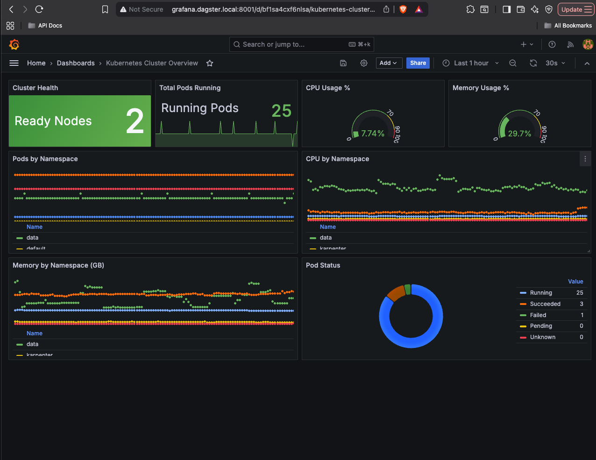
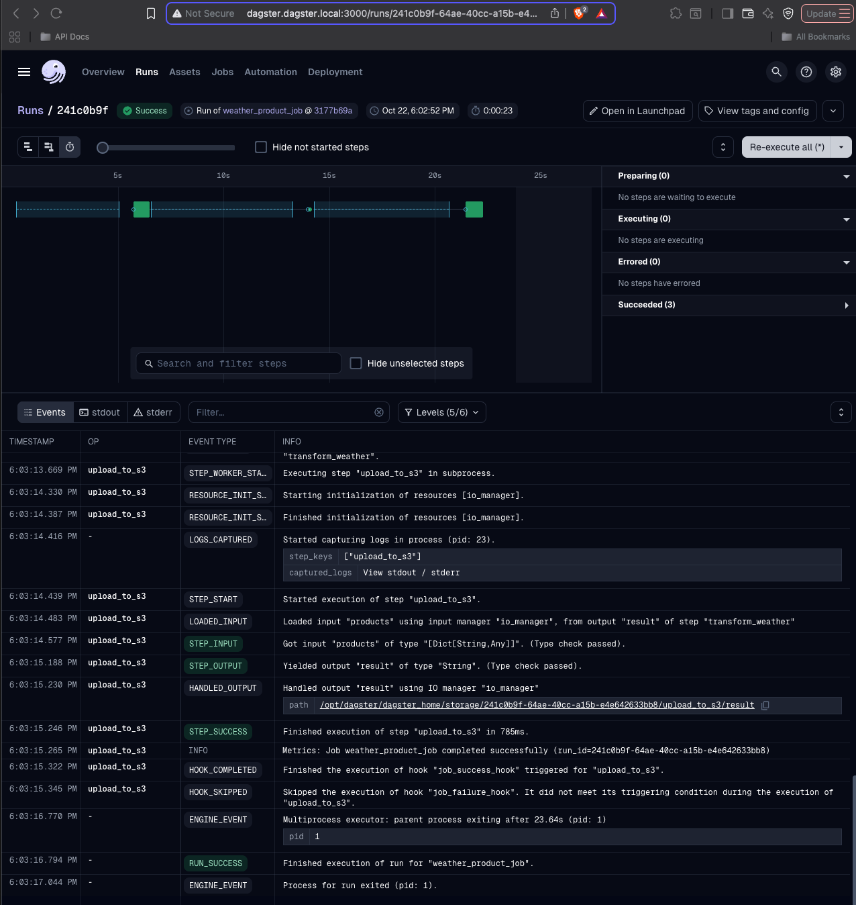
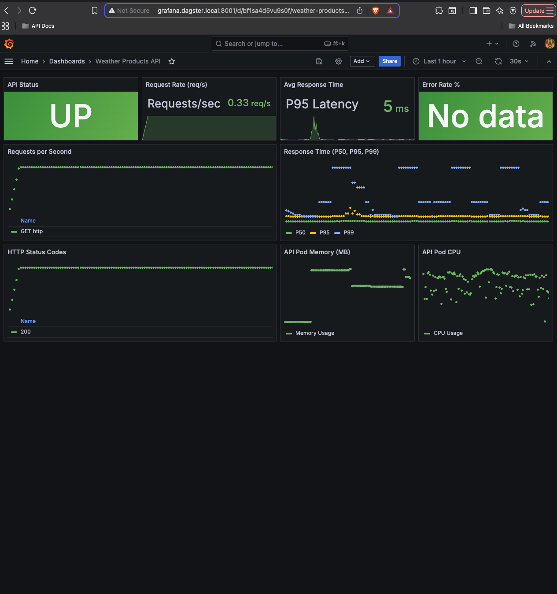
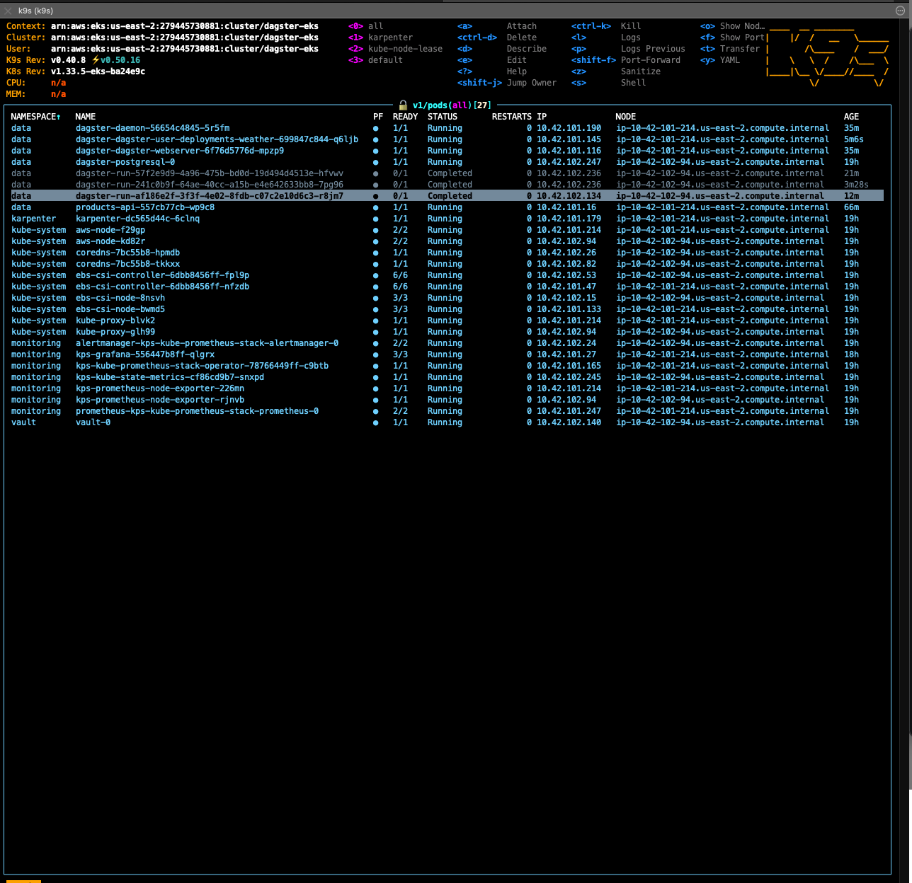
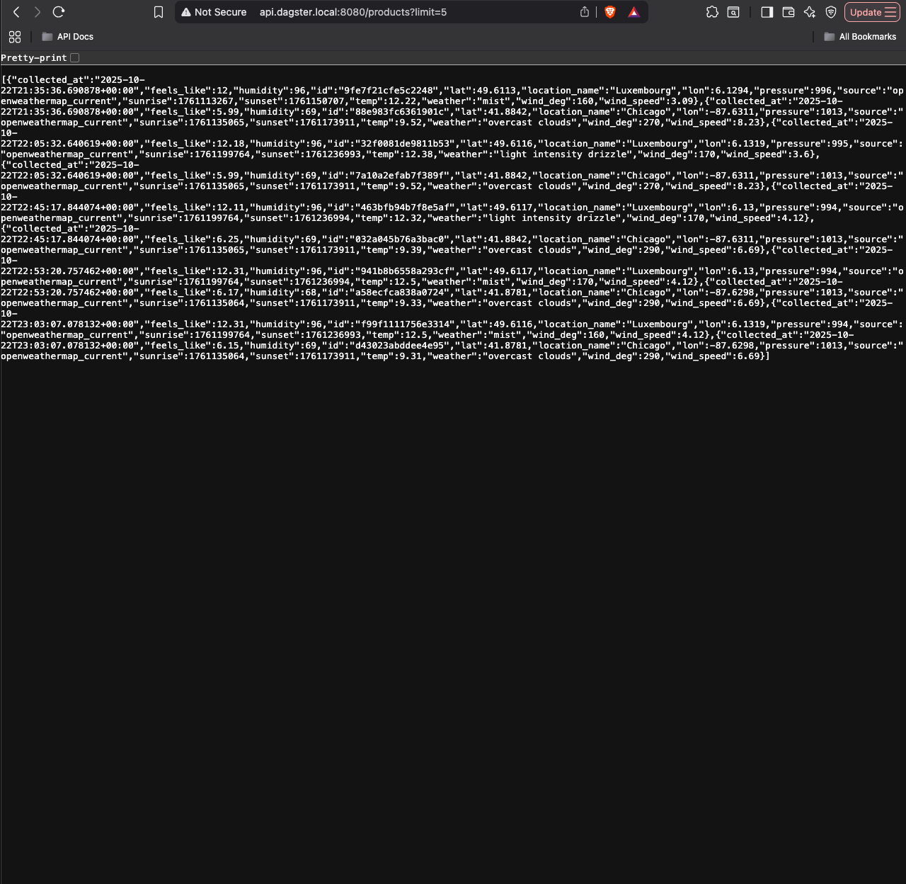

# Working Examples - Live System Verification

This page provides working command-line examples and visual proof of the deployed platform, showing all major components of the Dagster Data Platform in action.

---

## 1. Grafana - Kubernetes Cluster Overview

Grafana dashboard showing comprehensive Kubernetes cluster health metrics:



- Real-time pod status monitoring
- Namespace-level resource breakdown
- Historical trend analysis with time-series graphs

---

## 2. Dagster Job Execution

The completed job run showing successful execution with detailed step logs:



---

## 3. Grafana - Weather Products API Dashboard

Custom Grafana dashboard monitoring the FastAPI weather products service:



**API Metrics:**
- **Status**: UP (healthy)
- **Request Rate**: 0.33 req/s
- **Response Time (P95)**: 5ms
- **Error Rate**: No data (0% errors)
- **HTTP Status Codes**: All 200 (Success)
- **Resource Usage**: Pod Memory (~150MB), Pod CPU (minimal)

**Dashboard Features:**
- Request rate trends over time
- Response time percentiles (P50, P95, P99)
- HTTP status code distribution
- Pod-level resource monitoring

---

## 4. EKS - Cluster Overview

All pods across the entire cluster:



**Namespaces Visible:**
- **data**: Dagster components, PostgreSQL, Products API
  - `dagster-daemon` - Schedules and sensors
  - `dagster-dagster-user-deployments-weather` - Pipeline code
  - `dagster-dagster-webserver` - Dagster UI
  - `dagster-postgresql` - Metadata storage
  - `products-api` - FastAPI service
  - `dagster-run-*` - Completed job runs (Kubernetes Jobs)

- **karpenter**: Autoscaling infrastructure
  - `karpenter` - Node provisioner

- **kube-system**: Kubernetes core components
  - AWS CNI, CoreDNS, EBS/CSI controllers
  - `kube-proxy` - Network routing

- **monitoring**: Observability stack
  - `alertmanager` - Alert routing
  - `grafana` - Visualization
  - `kps-kube-prometheus-stack-operator` - Prometheus Operator
  - `kps-kube-prometheus-stack-prometheus` - Metrics collection
  - Node exporters for system metrics

- **vault**: Secrets management
  - `vault-0` - HashiCorp Vault instance

---

## 5. Weather API Response

JSON response from the Products API showing actual weather data retrieved and processed by the pipeline:



**Data Sample (Luxembourg & Chicago):**

```json
{
  "collected_at": "2025-10-22T21:35:36.090874+00:00",
  "feels_like": 12,
  "humidity": 96,
  "id": "9fe7721cfe5c2248",
  "lat": 49.6113,
  "location_name": "Luxembourg",
  "lon": 6.1194,
  "pressure": 996,
  "source": "openweathermap_current",
  "sunrise": 1761135065,
  "sunset": 1761173911,
  "temp": 12.01,
  "weather": "overcast clouds",
  "wind_deg": 170,
  "wind_speed": 4.12
}
```

**API Features:**
- ✅ Data successfully fetched from OpenWeather API
- ✅ Transformed with metadata (timestamps, IDs)
- ✅ Stored in S3 (demonstrated in earlier screenshots)
- ✅ Retrieved via FastAPI endpoint
- ✅ Multiple locations (Luxembourg, Chicago)
- ✅ Complete weather metrics (temperature, humidity, wind, pressure)

---

## 6. Bastion Host - Secure API Access

The Products API uses a **ClusterIP** service (no public IP) for security. To access it, we use a bastion host in the public subnet.

**Command:**
```bash
ssh -i .ssh/bastion-key.pem -o StrictHostKeyChecking=no ec2-user@<BASTION_IP> \
  "curl -s http://localhost:8080/products?limit=3 | jq"
```

**Live Output:**
```json
[
  {
    "collected_at": "2025-10-22T22:45:17.844074+00:00",
    "feels_like": 12.11,
    "humidity": 96,
    "id": "463bfb94b7f8e5af",
    "lat": 49.6117,
    "location_name": "Luxembourg",
    "lon": 6.13,
    "pressure": 994,
    "source": "openweathermap_current",
    "sunrise": 1761199764,
    "sunset": 1761236994,
    "temp": 12.32,
    "weather": "light intensity drizzle",
    "wind_deg": 170,
    "wind_speed": 4.12
  },
  {
    "collected_at": "2025-10-22T22:45:17.844074+00:00",
    "feels_like": 6.25,
    "humidity": 69,
    "id": "032a045b76a3bac0",
    "lat": 41.8842,
    "location_name": "Chicago",
    "lon": -87.6311,
    "pressure": 1013,
    "source": "openweathermap_current",
    "sunrise": 1761135065,
    "sunset": 1761173911,
    "temp": 9.39,
    "weather": "overcast clouds",
    "wind_deg": 290,
    "wind_speed": 6.69
  },
  {
    "collected_at": "2025-10-22T22:53:20.757462+00:00",
    "feels_like": 12.31,
    "humidity": 96,
    "id": "941b8b6558a293cf",
    "lat": 49.6117,
    "location_name": "Luxembourg",
    "lon": 6.13,
    "pressure": 994,
    "source": "openweathermap_current",
    "sunrise": 1761199764,
    "sunset": 1761236994,
    "temp": 12.5,
    "weather": "mist",
    "wind_deg": 170,
    "wind_speed": 4.12
  }
]
```

**How to get your bastion IP:**
```bash
BASTION_IP=$(aws ec2 describe-instances \
  --filters "Name=tag:Name,Values=dagster-eks-bastion" \
  --query 'Reservations[0].Instances[0].PublicIpAddress' \
  --output text)
echo "Bastion IP: $BASTION_IP"
```

**Security Highlights:**
- ✅ API has no public IP (ClusterIP service type)
- ✅ Only accessible from within cluster or via bastion
- ✅ Bastion uses IAM role for EKS authentication (no static credentials)
- ✅ All bastion access logged via CloudTrail
- ✅ Demonstrates production-grade security pattern

---

## Accessing These Services

To access these services yourself:

```bash
# Dagster UI
kubectl port-forward -n data svc/dagster-dagster-webserver 3000:80
# Open: http://localhost:3000

# Grafana
kubectl port-forward -n monitoring svc/kps-grafana 8001:80
# Open: http://localhost:8001 (admin/prom-operator)

# Weather API
kubectl port-forward -n data svc/products-api 8080:8080
# Open: http://localhost:8080/products?limit=5

# Prometheus
kubectl port-forward -n monitoring svc/kps-kube-prometheus-stack-prometheus 9090:9090
# Open: http://localhost:9090
```

---

## 📚 Related Documentation

- **[README.md](../README.md)** - Project overview and quick start
- **[DEMO_GUIDE.md](../DEMO_GUIDE.md)** - Step-by-step demo walkthrough
- **[SETUP.md](SETUP.md)** - Complete deployment instructions
- **[MONITORING.md](MONITORING.md)** - Detailed monitoring setup
- **[OPERATIONS.md](OPERATIONS.md)** - Day-to-day operations guide
- **[ARCHITECTURE.md](ARCHITECTURE.md)** - Architecture decisions

